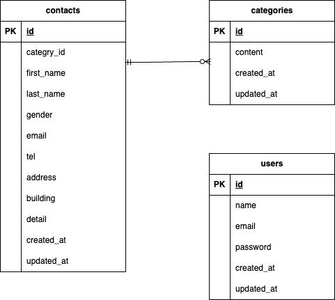

## アプリケーション名

お問い合わせフォーム

## 環境構築

1,Dockerコンテナを起動
bash
    - docker-compose build
    - docker-compose up -d

2,phpコンテナ内でLaravelの初期設定を行う
 - .envの作成
 - アプリケーションキーを生成
bash
    - docker-compose exec php bash
    - cp .env.example .env
    - php artisan key:generate

3,データベースの接続設定を行う
bash
    - DB_CONNECTION=mysql
    - DB_HOST=mysql
    - DB_PORT=3306
    - DB_DATABASE=laravel_db
    - DB_USERNAME=laravel_user
    - DB_PASSWORD=laravel_pass

4,マイグレーションを実行
bash
    - php artisan migrate

5,シーディングを実行
bash
    - php artisan db:seed

## ER 図

